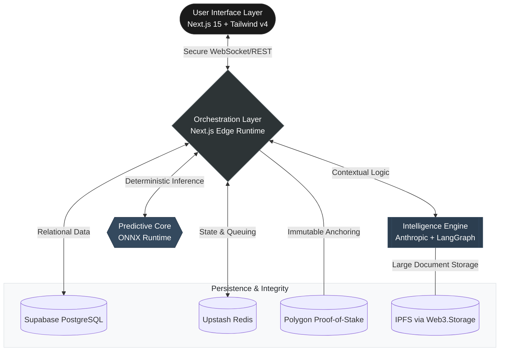

<div align="center">

# ⚖️ UnwindAI: Sovereign Legal Intelligence

**Enterprise-Grade Infrastructure for the Future of Automated Dispute Resolution**

*Synthesizing Agentic AI, Predictive ML, and Immutable Web3 Protocols*

[]()
[]()
[]()

---

**UnwindAI** is a mission-critical platform engineered to redefine the legal-tech landscape. It replaces legacy friction with high-fidelity predictive intelligence, combining the transparency of decentralized ledgers with the cognitive power of agentic AI.

[Documentation](#) • [Architecture](#) • [Features](#) • [Deployment](#)

</div>

---

## 🏛 Strategic Architecture

UnwindAI is built on a **Modular Sovereign Architecture**. Unlike monolithic legal platforms, it decouples the execution layer (Smart Contracts) from the intelligence layer (ML/LLMs), ensuring maximum scalability and data integrity.



## 💎 Core Value Pillars

### 1. Agentic Legal Intelligence
Harnessing **LangGraph** and **Anthropic's Claude 3.5**, UnwindAI doesn't just process text—it reasons through legal workflows. From automated risk assessment to complex document synthesis, our agents act as force multipliers for legal professionals.

### 2. High-Fidelity Predictive Modeling
Our ML stack utilizes specialized **ONNX runtimes** to deliver millisecond-latency predictions for:
- **Case Duration Forecasting:** Quantifying timeline risks with standard deviation confidence.
- **Cost Approximation:** Algorithmic budgeting based on historical precedent.
- **Anomaly Detection:** Identifying outlier cases before they consume excessive resources.

### 3. Immutable Web3 Audit Trails
By anchoring case milestones to the **Polygon Amoy Testnet**, we provide an unfalsifiable record of every critical event. This eliminates "he-said-she-said" disputes over procedural history.

### 4. "Quiet Clarity" Design System
A proprietary UI framework built on **TailwindCSS v4** and **Radix UI**, designed for focus and precision. The interface minimizes cognitive load, allowing users to navigate complex legal data with ease.

## 🛠 Engineering Stack

| Layer | Technologies |
| :--- | :--- |
| **Frontend** | React 19, Next.js 15, Framer Motion, Recharts, XYFlow |
| **Intelligence** | Anthropic SDK, LangChain/LangGraph, ONNX Web/Node |
| **State & Storage** | Supabase, Upstash Redis, BullMQ (Task Orchestration) |
| **Blockchain** | Viem, Wagmi, Hardhat, Ethers v6, Web3.Storage |
| **Security** | Zod (Validation), Otplib (2FA), JWT-based Auth |

## 🚀 Deployment & Initialization

### Environment Requirements
- **Runtime:** Node.js 18+ & Python 3.10+
- **Infrastructure:** Supabase Project, Redis Instance, Polygon RPC Node

### Rapid Setup
```bash
# Clone and Initialize
git clone https://github.com/pranavpanchal1326/UnwindAI.git
cd UnwindAI

# Install Multi-Runtime Dependencies
npm install
pip install -r requirements.txt

# Environment Setup
cp .env.example .env.local

# Execute Development Environment
npm run dev
```

---

## 🏗 Project Roadmap
- [x] Phase 1: Core UI & Design System Migration (v4.0 "Quiet Clarity")
- [x] Phase 2: Predictive Engine Integration (ONNX Pipeline)
- [ ] Phase 3: Agentic Workflow Automation (LangGraph Integration)
- [ ] Phase 4: Production Mainnet Deployment

<div align="center">
  <p><i>UnwindAI is a proprietary technology developed for high-stakes legal environments.</i></p>
  <p>© 2024 UnwindAI Labs. All Rights Reserved.</p>
</div>
